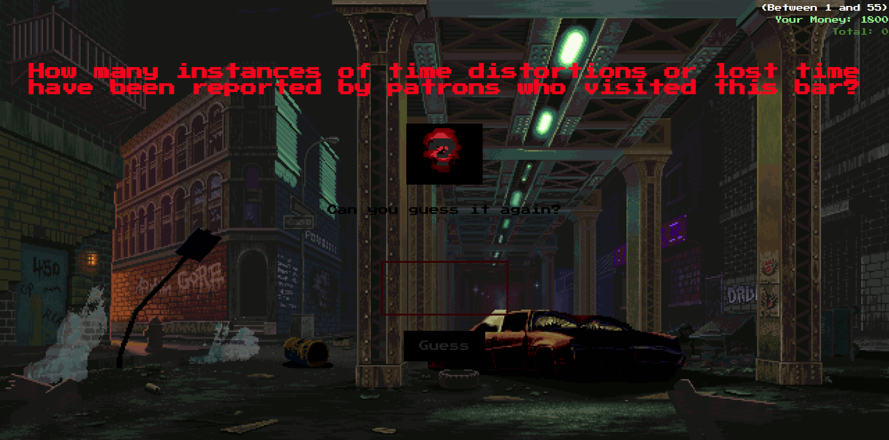

# 🎮 **The Guy's Game** – A Dark Psychological Guessing Game  
**"Are you ready to gamble... with your life?"**  

A twisted psychological guessing game where you wager against a sinister figure known only as **"The Guy."** Answer his unsettling, mind-bending questions correctly to earn money, but beware—one wrong answer might cost you everything. Will you escape with your life, or succumb to the darkness?

---

## 🕹️ **Main Menu**  


---

## 🔪 **In-Game**  


---

⚠️ **Warning**:  
*This game contains dark themes, disturbing content, and psychological horror. Player discretion is advised.*

---

## 🎲 **Game Mechanics**  

- **Guess the Number**: Answer unsettling, psychological questions with numerical guesses.  
- **High-Stakes Wagering**: Win or lose money based on how close your guesses are.  
- **Escape or Die**: Reach the target amount to win your freedom... or face a grisly demise.  

---

## 🕹️ **Features**  

🔀 **Randomized Questions**  
- Every round brings new, randomized questions to keep you guessing—and sweating.  

🎮 **Progressive Difficulty**  
- As the game progresses, the questions get tougher, and the stakes get higher.  

💰 **High-Stakes Gambling**  
- It's not just about guessing—it's about survival. Every decision counts.  

🖤 **Dark Humor & Psychological Tension**  
- Experience a game filled with dark humor, psychological twists, and chilling scenarios.  

♾️ **Addictive Gameplay Loop**  
- Simple mechanics, intense outcomes. Will you keep playing... or will "The Guy" get the best of you?  

---

## 📝 **Quote from The Guy**  
*"Sometimes the hardest part isn't guessing the number... it's living with the answer."*  

---

## 🔧 **Installation & Requirements**  

1. **Clone the Repository**  
   ```bash
   git clone https://github.com/yourusername/the-guys-game.git
   cd the-guys-game
