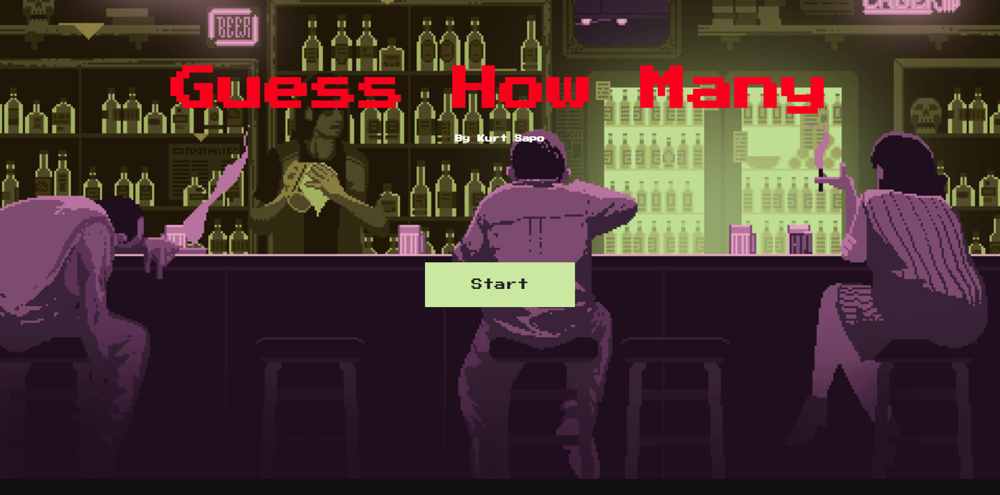

# The Guy's Game - A Dark Guessing Game

A twisted psychological guessing game where you make wagers with a mysterious figure known as "The Guy." Answer his disturbing questions correctly to earn money, but guess wrong and pay the price. Will you reach your goal and escape, or will you lose everything... including your life?
## Main Menu 🦷🩸🔪💀

## In Game 🔪💀

⚠️ **Warning**: Contains dark themes and disturbing content. Player discretion is advised.

## Game Mechanics

- 🎲 Answer unsettling questions with numerical guesses
- 💰 Win or lose money based on your answers
- 🎯 Reach the target amount to win your freedom
- ☠️ Run out of money, and it's game over... literally

## Features

- Randomized questions each round
- Progressive difficulty
- High-stakes gambling mechanics
- Dark humor and psychological tension
- Simple yet addictive gameplay loop

*"Sometimes the hardest part isn't guessing the number... it's living with the answer."*
